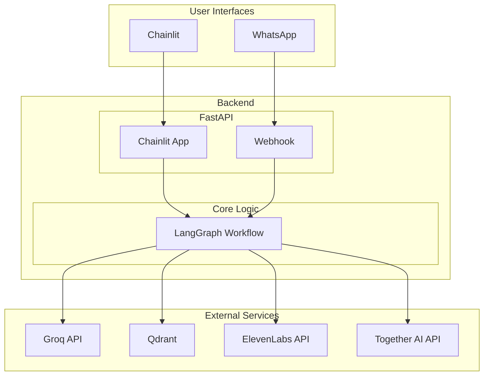
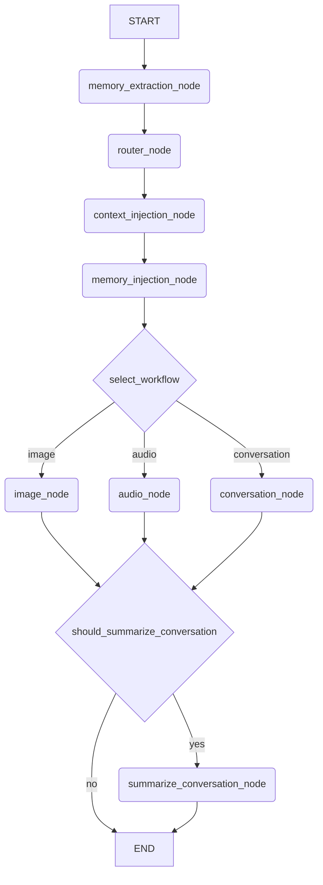

# Ava Architecture Documentation

## High-Level Architecture

This diagram provides a high-level overview of the Ava system architecture, illustrating the main components and their interactions.

## LangGraph Workflow

The following diagram illustrates the detailed workflow of the LangGraph implementation, showing the sequence of nodes and the conditional logic that governs the conversation flow.

## Component Descriptions

This section provides a detailed explanation of each component in the Ava architecture.

### User Interfaces

- **Chainlit**: A web-based interface for interacting with Ava. It's used for local development and testing.
- **WhatsApp**: The primary interface for end-users to interact with Ava. It connects to the backend via a webhook.

### Backend

- **FastAPI**: A high-performance Python web framework used to create the backend server. It hosts the Chainlit application and the WhatsApp webhook.
- **LangGraph Workflow**: The core of the application, built with LangGraph. It orchestrates the entire conversation flow, from receiving a user's message to generating a response.

### LangGraph Core

The LangGraph workflow is composed of nodes and edges that define the logic of the conversation.

#### Nodes

- **`memory_extraction_node`**: Extracts key information from the user's latest message and stores it in the long-term memory (Qdrant).
- **`router_node`**: Analyzes the recent conversation history to decide what type of response is needed (e.g., a standard text response, an image, or an audio message).
- **`context_injection_node`**: Injects Ava's current "activity" (based on a predefined schedule) into the conversation to provide context.
- **`memory_injection_node`**: Retrieves relevant memories from the long-term memory based on the current conversation and injects them into the prompt.
- **`conversation_node`**: Generates a text-based response using the language model. It takes into account the character's persona, current activity, and retrieved memories.
- **`image_node`**: Generates an image based on the conversation context and a corresponding text response.
- **`audio_node`**: Generates a spoken response using a text-to-speech model and returns the audio.
- **`summarize_conversation_node`**: Creates or updates a summary of the conversation when it becomes too long, helping to maintain long-term context efficiently.

#### Edges

- **`select_workflow`**: A conditional edge that directs the conversation to the appropriate node (`conversation_node`, `image_node`, or `audio_node`) based on the output of the `router_node`.
- **`should_summarize_conversation`**: A conditional edge that triggers the `summarize_conversation_node` if the number of messages in the conversation exceeds a certain threshold.

### Modules

- **`memory`**: Manages the short-term and long-term memory of the AI. It uses Qdrant as a vector database for long-term memory storage and retrieval.
- **`schedules`**: Manages Ava's "daily activities," providing context to the conversation.
- **`speech`**: Handles speech-to-text and text-to-speech functionality, using Whisper and ElevenLabs respectively.
- **`image`**: Manages image generation and vision capabilities, using Together AI and Groq's VLM models.

### External Services

- **Groq API**: Provides access to fast language models (Llama 3.3, Llama 3.2 Vision) and speech-to-text (Whisper) capabilities.
- **Qdrant**: A vector database used for storing and retrieving long-term memories.
- **ElevenLabs API**: Used for generating high-quality text-to-speech audio.
- **Together AI API**: Used for generating images with diffusion models.

## Data Flow

The following steps describe the end-to-end data flow for a typical user interaction:

1.  **User Input**: The user sends a message to Ava through either Chainlit or WhatsApp. The message can be text, an image, or an audio recording.
2.  **Webhook/Interface**: The message is received by the FastAPI backend. If it's from WhatsApp, the webhook is triggered. If it's from Chainlit, the Chainlit app handles it.
3.  **LangGraph Invocation**: The backend invokes the LangGraph workflow, passing the user's message and the current conversation state.
4.  **Memory Extraction**: The `memory_extraction_node` processes the user's message to identify and store any important information in the Qdrant long-term memory.
5.  **Routing**: The `router_node` determines the type of response required (conversation, image, or audio).
6.  **Context and Memory Injection**: The `context_injection_node` adds Ava's current activity to the state, and the `memory_injection_node` retrieves relevant memories from Qdrant.
7.  **Response Generation**: The workflow is directed to the appropriate node (`conversation_node`, `image_node`, or `audio_node`) to generate the response. This involves calling the necessary external services (Groq for text, Together AI for images, ElevenLabs for audio).
8.  **Conversation Summary**: If the conversation has reached a certain length, the `should_summarize_conversation` edge directs the workflow to the `summarize_conversation_node` to create or update a summary of the conversation.
9.  **Response Delivery**: The generated response (text, image, or audio) is sent back to the user through the same interface they used for the input.
